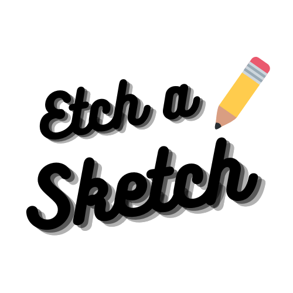

Etch-a-Sketch is a web project developed by Lucas Skaf and instructed by <a href="https://www.theodinproject.com/">The Odin Project</a> as a part of the curiculim on the Foundations of Web Development.
Troughtout this project a lot was learned about the structure of JavaScript and how it can intract with HTML and CSS. Different functions and methods were used to make sure that the user experiance and the code itself was as clean and smooth as possible.
<h3>Challanges</h3>

<ul>
<li>Which function to use to find appropriate HTML element.</li>
<li>How to make the tile of the canvas change color only if the user is clicking on it.</li>
<li>How to color the tiles with the custom color choosen by the user in the color picker.</li>
</ul>
<h3>Technology Used</h3>

<ul>
<li>HTML</li>
<li>CSS</li>
<li>JavaScript</li>
<li>Bootstrap</li>
</ul>
